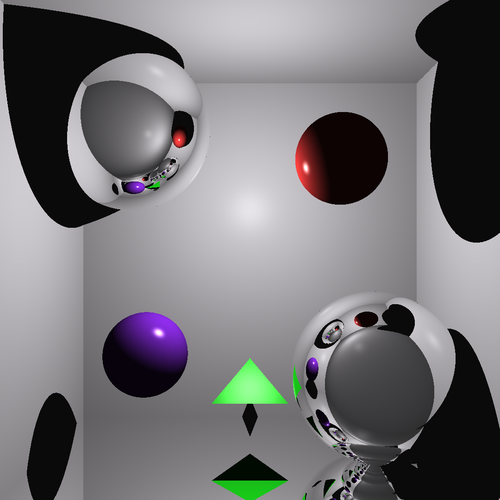

## OpenGL Ray Tracer



## Running

The project is built most easily using the [Nix package manager](https://nixos.org/download). Using Nix, we can compile this project without installing anything:

```sh
nix --extra-experimental-features "nix-command flakes" build github:ruby0b/opengl-ray-tracer
```

The result will be a single executable, located in `./result/bin/ray-tracer`.
Check out the command line parameters with `--help`.

If you are not on a NixOS system, chances are that the binary will fail to run due to Nix-related graphics driver issues.
We can use `nixGL` to work around this though:

```sh
NIXPKGS_ALLOW_UNFREE=1 nix --extra-experimental-features "nix-command flakes" run --override-input nixpkgs nixpkgs/nixos-23.11 --impure github:nix-community/nixGL -- result/bin/ray-tracer
```

## Development

You can enter a development shell with all the dependencies you need using:

```sh
nix develop
```

If you're using VSCode, install the clangd extension and disable the default C++ intellisense.
For clangd to work, you'll need to generate `build/compile_commands.json`:

```sh
nix develop --command sh -c 'rm -rf build; cmake -B build'
```
